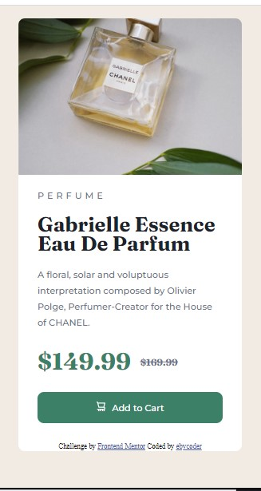

# Frontend Mentor - Product preview card component solution

This is a solution to the [Product preview card component challenge on Frontend Mentor](https://www.frontendmentor.io/challenges/product-preview-card-component-GO7UmttRfa). Frontend Mentor challenges help you improve your coding skills by building realistic projects. 

## Table of contents

- [Overview](#overview)
  - [The challenge](#the-challenge)
  - [Screenshot](#screenshot)
  - [Links](#links)
- [My process](#my-process)
  - [Built with](#built-with)
  - [What I learned](#what-i-learned)
  - [Continued development](#continued-development)
  - [Useful resources](#useful-resources)
- [Author](#author)

## Overview

### The challenge

Users should be able to:

- View the optimal layout depending on their device's screen size
- See hover and focus states for interactive elements

### Screenshot

 


### Links

- Solution URL: [Solution URL](https://github.com/eby-coder/friendly-watermelon.git)
- Live Site URL: [Live site URL](https://eby-coder.github.io/friendly-watermelon/)

## My process

### Built with

- Semantic HTML5 markup
- CSS custom properties
- Flexbox
- CSS Grid
- Visual Studio Code

### What I learned

I learnt quite a lot in this challenge. I have never before built a page that can be viewed in both desktop and mobile view correctly (I am not proud to say this:)) so, I finally learnt how to. I learnt how to adjust my code so that it can still be responsive when viewed with devices of different screen widths. I also learnt how to use the ::after property and a lot more of flex than I knew before. This has been really exciting to build.

My newly learnt code snippets:

```css
@media (min-width: 700px) {
    .entire-page {
        display: flex;
        width: 700px;
        margin: 50px auto;
        box-sizing: border-box;
    }
}

.price::after {
    content: '$169.99';
    font-size: 0.4em;
    color: var(--dark-grayish-blue);
    text-decoration: line-through;
    position: absolute;
    transform: translate(1em, 1em);
}

*,
*::before,
*::after {
  box-sizing: border-box;
}
```

### Continued development

In future projects, I will like to continue learning how to make my site responsive and compatible in any device. I will also like to continue learning more on displays and all the ::properties. 

### Useful resources

- [Resource 1](https://julianlivrone.github.io/Product-preview-card-component/) - I learnt how to optimize my site for all devices by studying the code written by this web designer.

## Author

- Website - [Ebere Ndukwu](https://www.i-don't-have-a-site-yet.com)
- Frontend Mentor - [@eby-coder](https://www.frontendmentor.io/profile/eby-coder)
